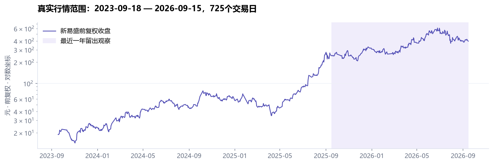
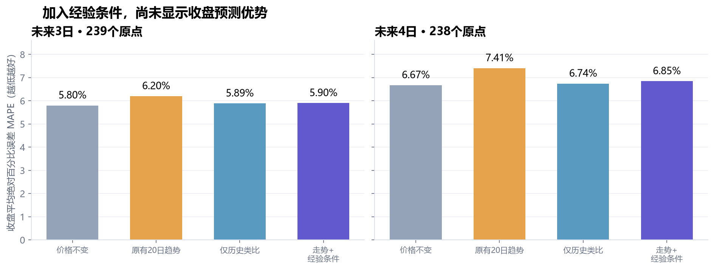
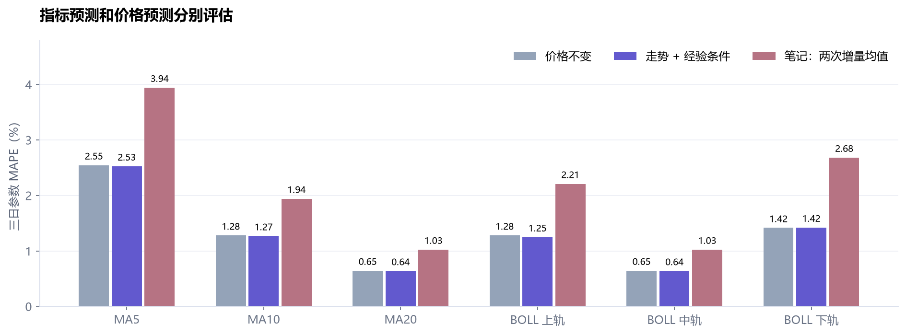
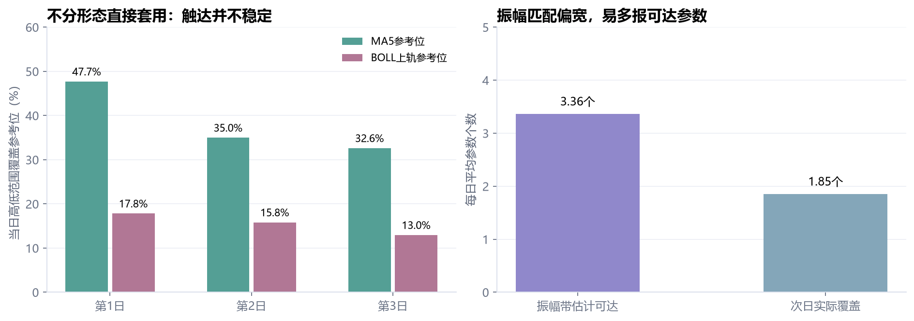
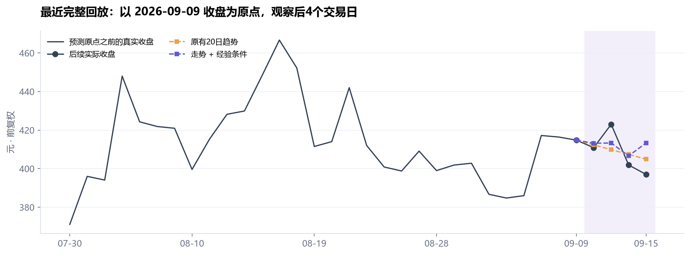

# 新易盛三年真实行情：经验与原则的回溯检验

本轮读取最新股票笔记的全部140份Markdown，提取142个候选片段，验证324段原文引文，归并为64个研究主题，并登记用户补充的10条经验/原则/提示。

**直接结论：目前不能证明“加入经验条件”提高了三日收盘预测准确率。优先把经验定义清楚、保留版本和反例、积累前瞻记录，而不是不停微调Agent。**

## 数据和方法

- 证券：新易盛300502.SZ；2023-09-18至2026-09-15，725个交易日；2022年起行情仅用于指标预热和已成熟历史案例。
- 腾讯按年分段获取；与新浪重叠的1023根原始日线，OHLC差异为0，成交量最大差50股；市场日历无缺口。
- 原始数据已有9月16日，前复权日线只到9月15日，统一用后者截止，不人为补齐。
- 每个收盘原点只使用当时及以前数据，预测未来1–4个交易日。MA5/10/20用简单均值；BOLL用20日均值±2倍总体标准差。
- 最近一年从2025-09-16留出，固定参数逐日检验。类比模型只用当前10日观察窗口之前已经走完后4日的案例；每5日抽取候选，最近504日内选20个邻居。
- 走势+经验模型使用相同案例与算法，额外按MA/BOLL、双高和市场状态相似度加权。权重0.5在结果分析前固定，不按结果调优。
- 当前笔记与提取版本晚于历史日期，因此这是**当前知识的时间顺序回溯模拟**，不是当年的实盘样本外证明。只选这只股票存在选择偏差；前复权使用今天的数据版本。

## 价格预测结果

以下为最近一年留出区间；3日239个原点，4日238个原点。MAPE越低越好。

|方法|三日收盘MAPE|四日收盘MAPE|三日方向正确率|
|---|---:|---:|---:|
|价格不变|5.80%|6.67%|不预测方向|
|原有20日趋势|6.20%|7.41%|46.44%|
|仅历史类比|5.89%|6.74%|52.30%|
|走势 + 经验条件|5.90%|6.85%|51.46%|

三日始终预测上涨的方向对照为53.14%。价格不变只作数值误差对照，不把其平盘预测硬比方向胜率。

经验条件相对纯价格类比的三日误差改善为-0.0153个百分点，20日时间块bootstrap的95%区间为[-0.1470, 0.1360]，跨0。组合模型的名义80%历史案例区间实际覆盖74.06%，也不能称为已校准的80%置信区间。

## MA与BOLL参数

笔记里有清楚的增量外推案例：`I(t+h)=I(t)+h×最近指标增量`，以及对近两次增量取均值的“前三后三”版本。它们预测的是参考参数，不能无依据改写成未来收盘价。

三日MA5 MAPE：两次增量外推3.94%，价格不变后重算指标2.55%；上轨分别2.21%和1.28%。不能把外推步骤看作准确率保证。

直接分别外推三条BOLL线还会破坏上下顺序：最近增量版本出现16次，两次增量版本13次（每种方法各2890个1–4日预测）。结果保留，没有挑掉坏样本；实际使用前应加一致性检查并标记无效，而不是强行调换轨道。

## 用户补充的三天参考位与振幅匹配

本次先把“三天5日线/三天上轨”解释为未来三天参数，不是连续三天站上均线。分别检查“第h日是否覆盖第h日参考位”和“明天覆盖未来三组参考位中的几个”。使用近20日真实波幅中位数定义`收盘±一个波幅`的研究可达带，相近价位按0.1%合并。

该简化定义下，预测平均可达3.36个参数，实际平均1.85个，数量平均绝对误差1.68个；可达参考位的触达精确率51.11%。它偏向“多报可达位”，需要分市场状态校准，不能自动生成买卖指令。

全部状态和“收盘位于上升MA5之上”的研究代理均保留在`results/principle-summary.json`；后者也不是完整的攀升/葛兰碧识别。日内高低范围覆盖价格，不证明先买后卖、可成交或T+1可卖，故没有虚构策略收益。

## 最近完整回放

固定使用最后一个具备完整4日实际结果的原点2026-09-09，避免挑选效果最好的片段。虚线为按当时输入重放的预测，深色为后续实际收盘。

## 怎样管理和改进

- 经验记录条件关系；交易原则约束资格/持有/退出；临时提示绑定品种、股票和有效期。原文不可被AI解释覆盖。
- 来源→知识版本→计算定义→回测版本→使用策略→预测快照→真实结果，保持引用链。确认解释、测试通过和启用是三个动作。
- “葛一/葛二/照镜子/大涨/破位”需要可重复标注、阈值或分时数据。基础葛二退出与强势持有、次新股禁做与板块例外不能机械合并。
- 当前6条exact_daily候选只是计算片段（包括均线和OHLC聚合定义），不是六套已验证买卖策略。73条需显式代理、20条需分时、23条需外部数据、20条需人工定义。
- 持续追加行情和预测兑现结果；固定规则版本定期复评。对解析错误先改词典/检索/结构化约束，对数值预测研究专门模型；有足量高质量标注和稳定评测后，才讨论微调Agent。
- 下一步证据应来自预先选定的多股票、多市况和真正未来时段；不得反复查看留出结果后调参却仍称其为独立留出。

## 核验与复跑

5项计算与无未来数据测试通过；独立审查逐项重算2,890条Java基线预测及MA/BOLL、核对5,780条类比预测训练边界、48组价格汇总和48组配对差值，无重大差异。

核心脚本：`validate_inputs.py` → `backtest.py` → `evaluate_principles.py` → `build_catalog.py` → `render_report.py`。逐原点账本保留所有好坏结果。`analysis.ipynb`提供带图的重跑入口。

来源：GitHub笔记版本`707f4fe0032ff44f309e7f374ba68f16d9e065af`；所有行情URL、时间戳和SHA256见`source-manifest.json`，324段笔记证据见`knowledge-catalog.json`。外链音频/视频未转录，未读取的图片已在原文清单记录；不能称为已完整解析全部附件。
